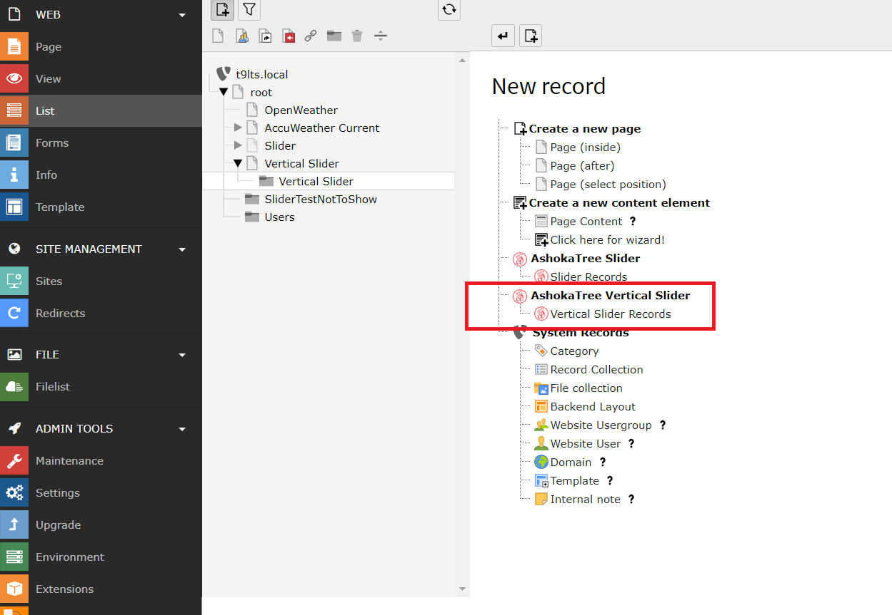
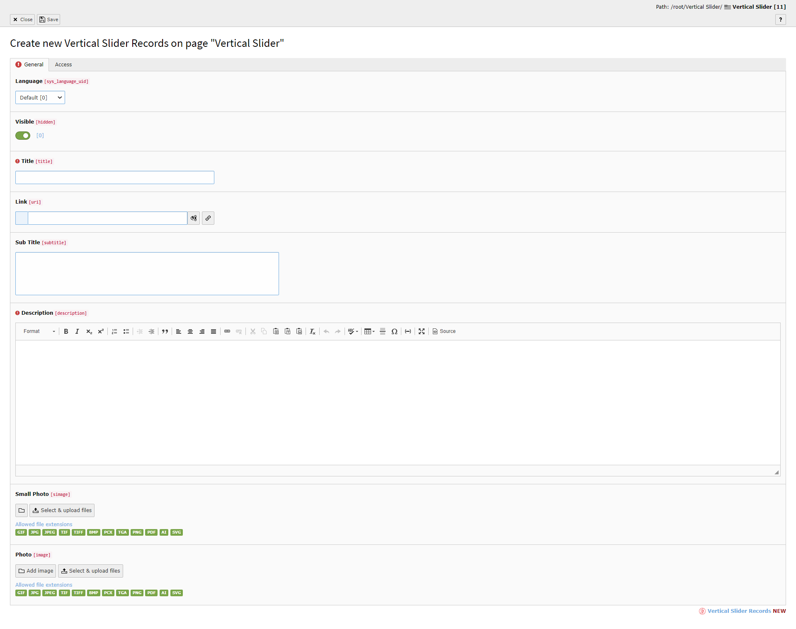
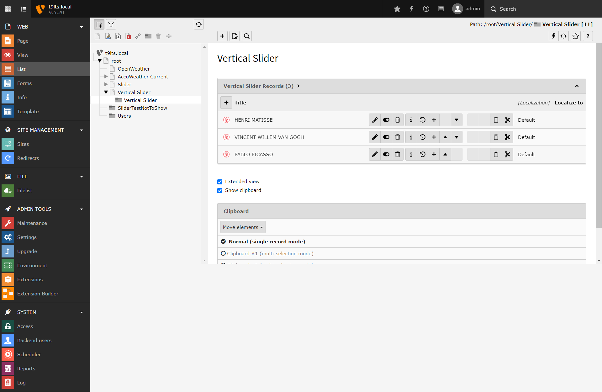
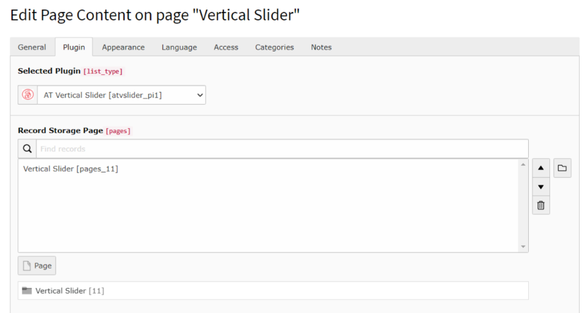

.. ==================================================
.. FOR YOUR INFORMATION
.. --------------------------------------------------
.. -*- coding: utf-8 -*- with BOM.

.. include:: ../Includes.txt

.. _user-manual:

Users Manual
============

Target group: **Editors**

- Create s Sysfolder.

- Create new Slider records

   Create new Slider Record option.

- Slider record create/ edit form.

   Create, Edit - Slider record.

  - List view of Slider records.

  - Insert Slider plugin as a page content and specify sysfolders (optional).

